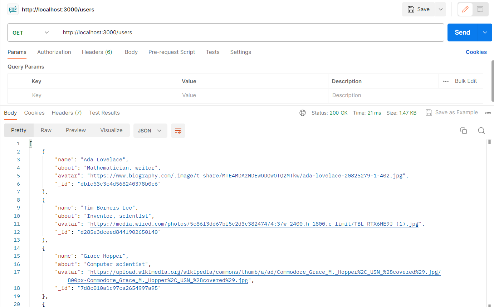
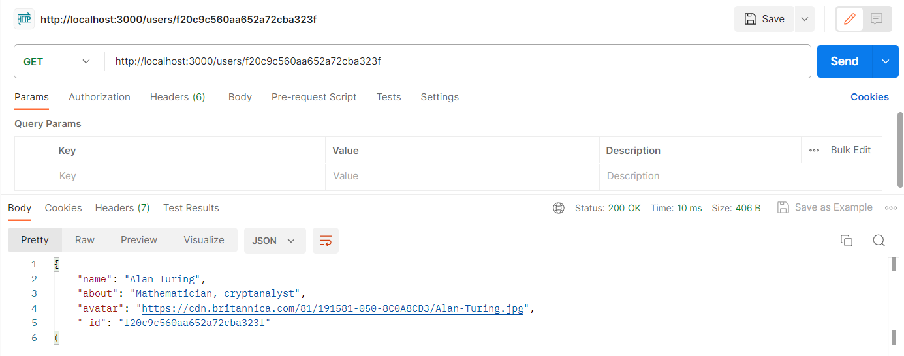
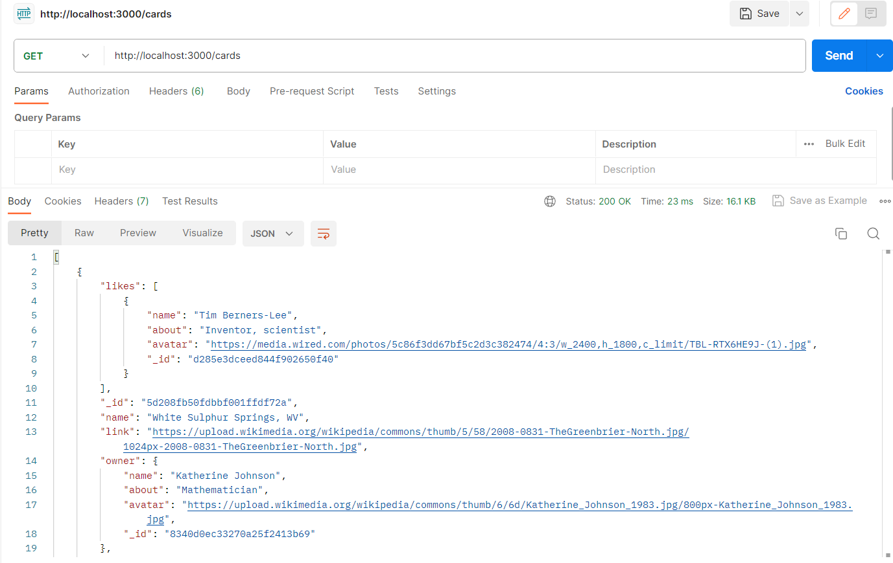
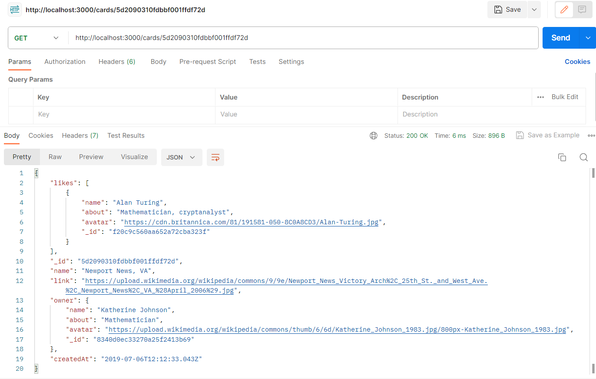
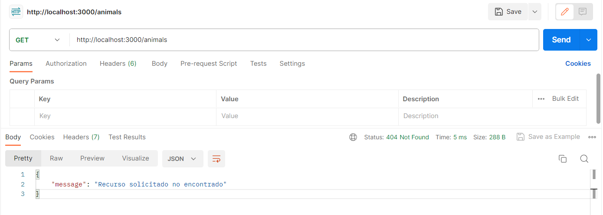
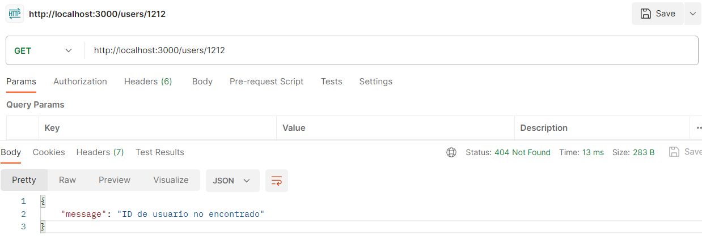
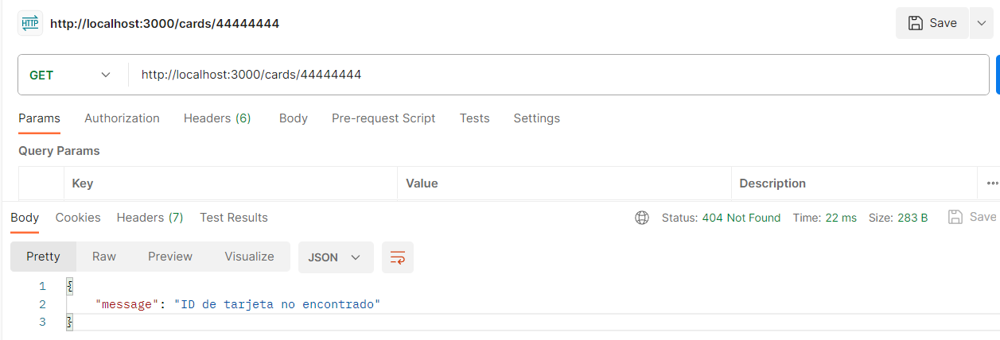

# Proyecto 13 - web_project_around_express

Esta es una aplicación Express básica que sirve datos relacionados con tarjetas (cards) y usuarios desde archivos JSON.

## Tecnologías Utilizadas

### Express.js

Framework para Node.js que facilita la creación de aplicaciones web. Utilizado en este proyecto para gestionar endpoints, middlewares y manejo de errores.

### Node.js

Entorno de ejecución que permite correr JavaScript en el servidor. Es la base sobre la que se construye y ejecuta nuestra aplicación Express.

### FS y Path

Módulos integrados en Node.js. `FS` se utiliza para la lectura de archivos, y `Path` para gestionar y resolver rutas de archivos.

## Instalación:

Sigue estos pasos para configurar y ejecutar el proyecto en tu máquina local:

1. **Clonar el repositorio**: Comienza clonando el repositorio de GitHub en tu máquina local utilizando el siguiente comando:

   git clone https://github.com/JordanEsquivelS/web_project_around_express.git

2. **Instalar dependencias**: Abre una terminal en la carpeta raíz del proyecto y ejecuta el siguiente comando para instalar todas las dependencias necesarias:

   npm install

3. **Ejecutar en modo de desarrollo**: Una vez que todas las dependencias estén instaladas, puedes ejecutar el proyecto en modo de desarrollo con el siguiente comando:

   npm start

## Demostración - Endpoints

### Usuarios

- `GET /users` : Devuelve una lista de todos los usuarios.

  

- `GET /users/:id` : Devuelve un usuario específico basado en su ID. (Ejemplo Id: `f20c9c560aa652a72cba323f` )

  

### Tarjetas (Cards)

- `GET /cards` : Devuelve una lista de todas las tarjetas.

  

- `GET /cards/:cardId` : Devuelve una tarjeta específica basada en su ID. (Ejemplo Id: `5d2090310fdbbf001ffdf72d` )

  

## Manejo de Errores

- Si se accede a un recurso no existente, devuelve un error 404 con el mensaje "Recurso solicitado no encontrado".

  

- Si se solicita un usuario con `Id invalido`, devuelve un mensaje de error: ID de usuario no encontrado. (Ejemplo Id: `1212`)

  

- Si se solicita una tarjeta con `Id invalido`, devuelve un mensaje de error: ID de tarjeta no encontrado. (Ejemplo Id: `44444444`)

  

- En caso de un error del servidor, devuelve un error 500 con el mensaje "¡Algo salió mal!".

## Demostración Video - Servidor

Haz clic en el siguiente enlace para ver la demostración del proyecto en YouTube :

